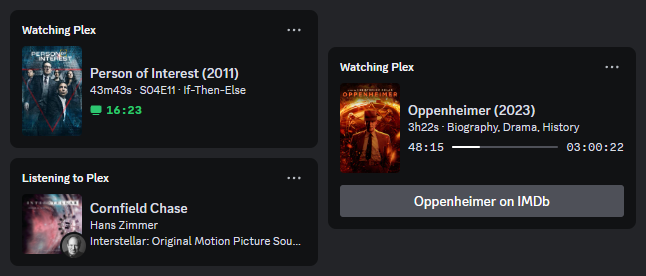
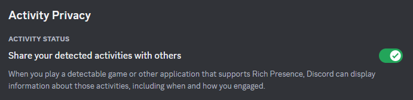

# Discord Rich Presence for Plex



Discord Rich Presence for Plex is a Python script which displays your [Plex](https://www.plex.tv/) status on [Discord](https://discord.com/) using [Rich Presence](https://discord.com/developers/docs/rich-presence/overview).

[](https://github.com/phin05/discord-rich-presence-plex/releases/latest)
[](https://github.com/phin05/discord-rich-presence-plex/actions/workflows/release.yml)

## Installation

### Windows (Standalone Executable - Recommended)

**No Python installation required!**

1. Download `PlexDiscordRPC-v*.exe` from the [latest release](https://github.com/phin05/discord-rich-presence-plex/releases/latest)
2. Double-click the executable to run
3. The app will appear in your Windows system tray (bottom-right corner)
4. Right-click the tray icon to access the menu
5. On first run, your browser will open for Plex authentication

**Data Storage**: Config, cache, and logs are stored in `%APPDATA%\PlexDiscordRPC` and persist across updates.

**System Tray Features**:
- **Settings window** - Graphical configuration editor (no manual YAML editing needed!)
- Pause/Resume monitoring without restarting
- Open data folder, config file, or log file from tray menu
- Runs silently in the background (no console window)

### Python Script (Cross-Platform)

If you're using a Linux-based operating system, you can [run this script with Docker](#run-with-docker). Otherwise, follow these instructions:

1. Install [Python](https://www.python.org/downloads/) (version 3.10 or newer) - Make sure to tick "Add Python to PATH" during the installation.
2. Download the [latest release](https://github.com/phin05/discord-rich-presence-plex/releases/latest) of this script.
3. Extract the directory contained in the above ZIP file.
4. Navigate a command-line interface (cmd, PowerShell, bash, etc.) into the above-extracted directory.
5. Start the script by running `python main.py`.

When the script runs for the first time, a directory named `data` will be created in the current working directory along with a `config.yaml` file inside of it. You will be prompted to complete authentication to allow the script to retrieve an access token for your Plex account.

The script must be running on the same machine as your Discord client.

## Configuration

### Easy Configuration (Windows Executable)

**The easiest way to configure the application is through the GUI settings window:**

1. Right-click the system tray icon
2. Click **"Settings..."**
3. Adjust settings in the tabbed interface:
   - **Display Settings**: What metadata to show (duration, year, genres, etc.)
   - **Posters & Images**: Enable poster display and configure Imgur
   - **Logging**: Debug logging and file output options
4. Click **"Save & Restart Required"**
5. Restart the application for changes to take effect

### Configuration File Location

For advanced users or when using the Python script:

- **Windows Executable**: `%APPDATA%\PlexDiscordRPC\config.yaml`
  - Quick access: Right-click tray icon → "Open Data Folder" or "Open Config File"
- **Python Script / Docker**: `./data/config.yaml` (in the application directory)

### Supported Formats

- YAML - `config.yaml` / `config.yml`
- JSON - `config.json`

### Common Configuration Options

**Most settings are available in the GUI (Windows executable).** For manual editing or Python/Docker users:

**Display Settings:**
- `display.duration` - Show total duration (movies/TV)
- `display.year` - Show release year
- `display.genres` - Show genres (movies only)
- `display.progressMode` - Progress display: `bar`, `elapsed`, `remaining`, or `off`
- `display.paused` - Show Rich Presence while paused

**Poster Settings:**
- `display.posters.enabled` - Enable poster display (requires Imgur)
- `display.posters.imgurClientID` - [Get Imgur Client ID](#obtaining-an-imgur-client-id)
- `display.posters.maxSize` - Max poster size (default: 256px)

**Music Settings:**
- `display.album` / `display.artist` - Show album/artist name
- `display.albumImage` / `display.artistImage` - Show images

**Advanced Settings:**
- `users[].servers[].blacklistedLibraries` - Libraries to ignore
- `users[].servers[].whitelistedLibraries` - Only monitor these libraries
- `users[].servers[].ipcPipeNumber` - Discord IPC pipe (0-9, default: -1 for auto)

**💡 Tip:** Use the Settings window (Windows exe) to configure these visually. See full configuration reference in [DOCS.md](DOCS.md).

### Obtaining an Imgur client ID

1. Go to Imgur's [application registration page](https://api.imgur.com/oauth2/addclient).
2. Enter any name for the application and pick "OAuth 2 authorization without a callback URL" as the authorisation type.
3. Submit the form to obtain your application's client ID.

### Buttons

Discord can display up to 2 buttons in your Rich Presence. Buttons are visible to only other users and not yourself (Discord bug/limitation).

#### Dynamic Button Labels

Instances of `{title}` in button labels will be replaced with the top-level title of the media being played.

#### Dynamic Button URLs

During runtime, the following dynamic URL placeholders will get replaced with real URLs based on the media being played:

- `dynamic:imdb`
- `dynamic:tmdb`
- `dynamic:thetvdb`
- `dynamic:trakt`
- `dynamic:letterboxd`
- `dynamic:musicbrainz`

### Example (YAML)

```yaml
logging:
  debug: true
  writeToFile: false
display:
  duration: true
  genres: true
  album: true
  year: true
  statusIcon: false
  progressMode: bar
  paused: false
  posters:
    enabled: true
    imgurClientID: 9e9sf637S8bRp4z
    maxSize: 256
  buttons:
    - label: "{title} on IMDb"
      url: dynamic:imdb
    - label: Music Stats
      url: https://github.com
      mediaTypes:
        - track
users:
  - token: HPbrz2NhfLRjU888Rrdt
    servers:
      - name: Bob's Home Media Server
      - name: A Friend's Server
        whitelistedLibraries:
          - Movies
```

## Troubleshooting

### Rich Presence Not Showing

**Discord Settings:**
- Ensure you're not set to invisible
- Enable "Share your detected activities with others" under: Discord Settings → Activity Settings → Activity Privacy



**Application Issues:**
- Windows exe: Check logs via tray menu → "Open Log File"
- Verify Discord is running on the **same machine** (IPC is local-only)
- Restart both Discord and the application

### Configuration Not Saving

- Windows exe: Changes require **application restart** to take effect
- Manual edits: Check YAML syntax (use Settings window to avoid errors)
- Check file permissions in `%APPDATA%\PlexDiscordRPC`

### Can't Find Config File

- Windows exe: Right-click tray icon → "Open Data Folder"
- Location: `%APPDATA%\PlexDiscordRPC\config.yaml`
- Or use the GUI: Right-click tray icon → "Settings..."

### Need More Help?

- 📖 Documentation: [DOCS.md](DOCS.md)
- 🔧 Developer Guide: [CLAUDE.md](CLAUDE.md)
- 🐛 Report Issues: [GitHub Issues](https://github.com/italicninja/discord-rich-presence-plex/issues)
- 📋 Changelog: [CHANGELOG.md](CHANGELOG.md)

---

## Advanced Configuration

### Environment Variables

- `DRPP_PLEX_SERVER_NAME_INPUT` - Plex server name during initial setup (for non-interactive environments)
- `DRPP_NO_PIP_INSTALL` - Set to `true` to skip automatic dependency installation

## Run with Docker

### Image

[ghcr.io/phin05/discord-rich-presence-plex](https://ghcr.io/phin05/discord-rich-presence-plex)

Images are available for the following platforms:

- linux/amd64
- linux/arm64
- linux/386
- linux/arm/v7

### Volumes

Mount a directory for persistent data (config file, cache file and log file) at `/app/data`.

The runtime directory where Discord stores its inter-process communication Unix socket file needs to be mounted into the container at `/run/app`. The path for this would be the first non-null value from the values of the following environment variables in the environment Discord is running in: ([source](https://github.com/discord/discord-rpc/blob/963aa9f3e5ce81a4682c6ca3d136cddda614db33/src/connection_unix.cpp#L29C33-L29C33))

- XDG_RUNTIME_DIR
- TMPDIR
- TMP
- TEMP

If all four environment variables aren't set, `/tmp` is used.

For example, if the environment variable `XDG_RUNTIME_DIR` is set to `/run/user/1000`, that would be the runtime directory that needs to be mounted into the container at `/run/app`. If none of the environment variables are set, you need to mount `/tmp` into the container at `/run/app`.

### UID and GID

The environment variables `DRPP_UID` and `DRPP_GID` can be used to specify the UID and GID of the user Discord is running as. You can determine these by running `id` in your terminal as such user.

If both of the above environment variables are set, the script will change the ownership of `/run/app` and its contents to be in line with the specified UID and GID to prevent issues caused due to insufficient permissions. To skip this ownership change, set the environment variable `DRPP_NO_RUNTIME_DIR_CHOWN` to `true`. Skipping this is necessary only in cases where the runtime directory isn't exclusively dedicated for a single user.

The ownership of `/app` and its contents will be changed as well. If both of the above environment variables are set, they will determine the ownership. Otherwise, the existing ownership information of `/run/app` will be used.

### Other Info

If you're running the container for the first time (when there are no users in the config), set the `DRPP_PLEX_SERVER_NAME_INPUT` environment variable to the name of the Plex server to be added to the config file after user authentication, and check the container logs for the authentication link.

### Docker Compose example

```yaml
services:
  drpp:
    container_name: drpp
    image: ghcr.io/phin05/discord-rich-presence-plex:latest
    restart: unless-stopped
    environment:
      DRPP_UID: 1000
      DRPP_GID: 1000
    volumes:
      - ./data:/app/data
      - /run/user/1000:/run/app
```

### Containerised Discord

If you wish to run Discord in a container as well, you need to mount a designated directory from the host machine into your Discord container at the path where Discord would store its Unix socket file. You can determine this path by checking the environment variables inside the container as per the [volumes](#volumes) section above, or you can set one of the environment variables yourself. That same host directory needs to be mounted into this script's container at `/run/app`. Ensure that the designated directory being mounted into the containers is owned by the user the containerised Discord process is running as.

Depending on the Discord container image you're using, there might be a lot of resource usage overhead and other complications.

#### Docker Compose example using [kasmweb/discord](https://hub.docker.com/r/kasmweb/discord)

```yaml
services:
  kasmcord:
    container_name: kasmcord
    image: kasmweb/discord:1.14.0
    restart: unless-stopped
    ports:
      - 127.0.0.1:6901:6901
    shm_size: 512m
    environment:
      VNC_PW: password
      XDG_RUNTIME_DIR: /run/user/1000
    volumes:
      - ./kasmcord:/run/user/1000
    user: "0"
    entrypoint: sh -c "chmod 700 /run/user/1000 && chown -R kasm-user:kasm-user /run/user/1000 && su kasm-user -c '/dockerstartup/kasm_default_profile.sh /dockerstartup/vnc_startup.sh /dockerstartup/kasm_startup.sh'"
  drpp:
    container_name: drpp
    image: ghcr.io/phin05/discord-rich-presence-plex:latest
    restart: unless-stopped
    volumes:
      - ./drpp:/app/data
      - ./kasmcord:/run/app:ro
    depends_on:
      - kasmcord
```

### Docker on Windows and macOS

The container image for this script is based on Linux. Docker uses virtualisation to run Linux containers on Windows and macOS. In such cases, if you want to run this script's container, you need to run Discord in a Linux container as well, as per the instructions above.
